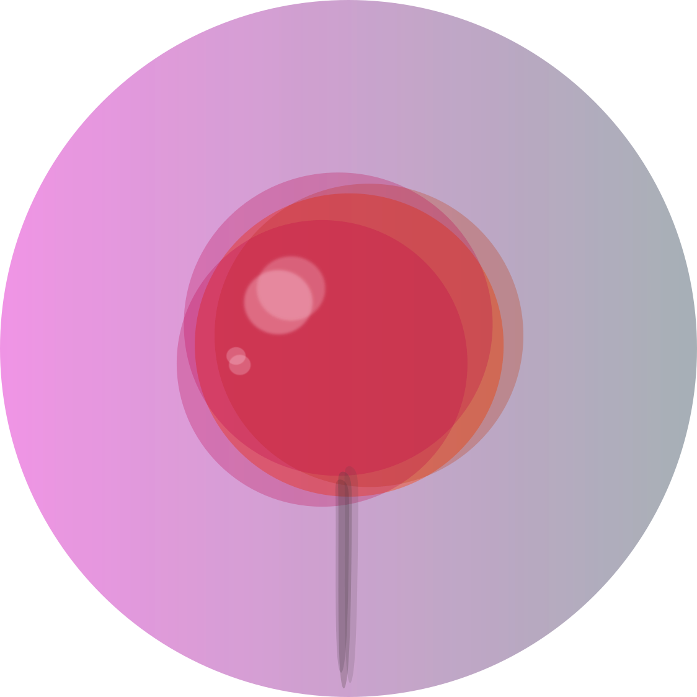
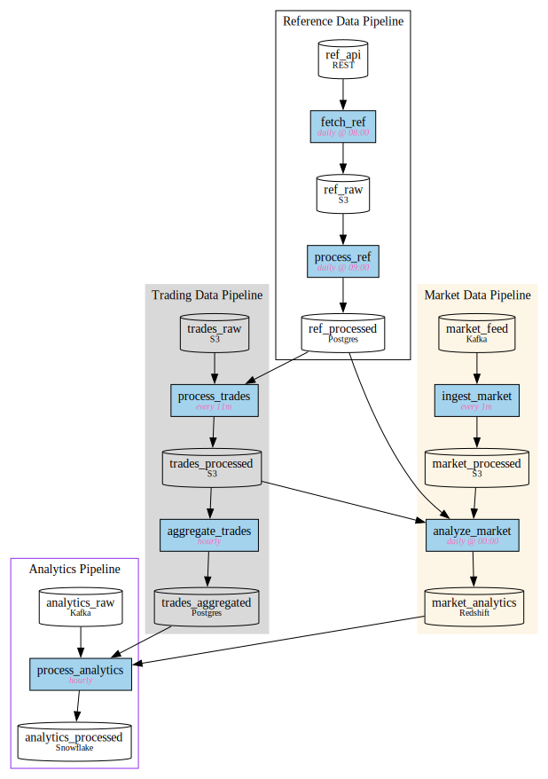

#  pin _(𝛼)_

**Easy, Beautiful Lineage**

Pin metadata to Scala objects, get beautiful GraphViz [DOT](https://graphviz.org/doc/info/lang.html) diagrams. ~~Doc-as-code~~ Your code is the doc 📌✨

## Features
- Decorate any Scala object, class or val with zero overhead
- Automatic subgraph nesting and cross-graph dependencies
- Drop **Pin.scala** into your project and start documenting
- Rich GraphViz options for shapes, colors, and styling

## Core Concepts
Stick `@pin` and/or `@subgraph` decorators in your Scala code. Compile it, get a Graphviz diagram. One step, that's it.

## `@pin` options

| Option | Type | Description | Example |
|--------|------|-------------|---------|
| name | String | Unique identifier for the pin | `"ingest"` |
| description | Option[String] | Optional description (10pt font) | `Some("Data ingestion")` |
| schedule | Option[String] | Optional schedule (pink italic) | `Some("every 10m")` |
| version | String | Version of the pin | `"1.0.0"` |
| tags | Set[String] | Tags for grouping/filtering | `Set("etl", "data")` |
| upstream | Set[String] | Dependencies on other pins | `Set("raw_data")` |
| dotOptions | Map[String,String] | GraphViz node attributes | `Map("shape" -> "cylinder")` |
| subgraph | Option[String] | Parent subgraph name | `Some("pipeline")` |

## `@subgraph` options

| Option | Type | Description | Example |
|--------|------|-------------|---------|
| name | String | Unique identifier | `"pipeline"` |
| label | Option[String] | Display label | `Some("Data Pipeline")` |
| upstream | Set[String] | Dependencies on other nodes | `Set("other_graph")` |
| dotOptions | Map[String,String] | GraphViz cluster attributes | `Map("style" -> "filled")` |
| parent | Option[String] | Parent subgraph for nesting | `Some("parent_graph")` |

## Real-World Example

