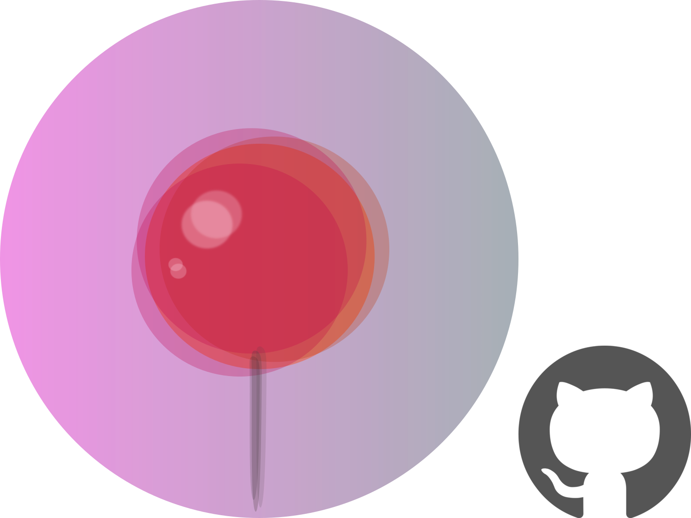
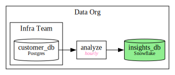
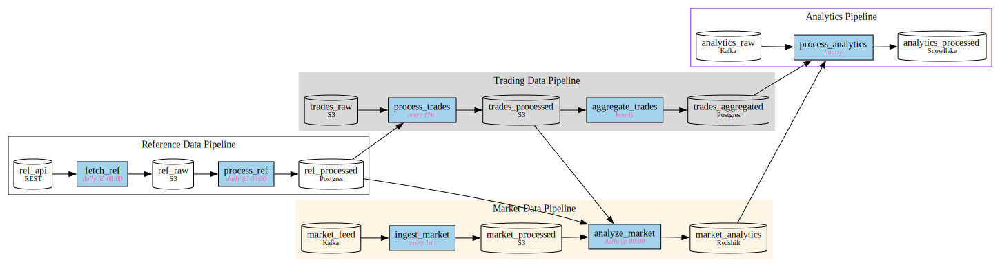

<p align="center">
  
</p>

# Pin _(experimental)_
**Easy, Beautiful Lineage**

Pin metadata to Scala objects, get beautiful GraphViz [DOT](https://graphviz.org/doc/info/lang.html) diagrams. ~~Doc-as-code~~ Your code is the doc 📌✨

## Features
- Decorate any Scala object, class or val with zero overhead
- Automatic subgraph nesting and cross-graph dependencies
- Drop **Pin.scala** into your project and start documenting
- Rich GraphViz options for shapes, colors, and styling

This code
```scala
import pin.core._

`@subgraph`("data", label = Some("Data Org"))
`@subgraph`("infra", label = Some("Infra Team"), parent=Some("data"))

`@pin`("customer_db", description = Some("Postgres"), dotOptions = Map("shape" -> "cylinder"), subgraph=Some("infra")){}
case class Data(values: List[Int])

`@pin`("analyze", schedule = Some("hourly"), upstream = Set("customer_db"), subgraph=Some("data")){}
def analyze(d: Data): Stats = ???

`@pin`("insights_db", description = Some("Snowflake"), upstream = Set("analyze"),
       dotOptions = Map("shape" -> "cylinder", "style"-> "filled", "fillcolor" -> "lightgreen"),
       subgraph=Some("data")){}
case class Stats(mean: Double)
```

Generates this DOT:



## Core Concepts
Stick `@pin` and/or `@subgraph` decorators in your Scala code. Compile it, get a Graphviz diagram. One step, that's it.

## `@pin` options

| Option | Type | Description | Example |
|--------|------|-------------|---------|
| name | String | Unique identifier for the pin | `"ingest"` |
| description | Option[String] | Optional description (10pt font) | `Some("Data ingestion")` |
| schedule | Option[String] | Optional schedule (pink italic) | `Some("every 10m")` |
| version | String | Version of the pin | `"1.0.0"` |
| tags | Set[String] | Tags for grouping/filtering | `Set("etl", "data")` |
| upstream | Set[String] | Dependencies on other pins | `Set("raw_data")` |
| dotOptions | Map[String,String] | GraphViz node attributes | `Map("shape" -> "cylinder")` |
| subgraph | Option[String] | Parent subgraph name | `Some("pipeline")` |

## `@subgraph` options

| Option | Type | Description | Example |
|--------|------|-------------|---------|
| name | String | Unique identifier | `"pipeline"` |
| label | Option[String] | Display label | `Some("Data Pipeline")` |
| upstream | Set[String] | Dependencies on other nodes | `Set("other_graph")` |
| dotOptions | Map[String,String] | GraphViz cluster attributes | `Map("style" -> "filled")` |
| parent | Option[String] | Parent subgraph for nesting | `Some("parent_graph")` |

## Real-World Example


This represents a synthetic production codebase. You have a bunch of data-models mapped to storage engines, and processing functions.

Developers will often work on one part, without knowing what goes on in the others.

Drop a few pins, and you have the beautiful GraphViz above.
```scala
import pin.core._

sealed trait DataModel

val CYLINDER_STYLE = Map("shape" -> "cylinder")
val BOX_STYLE = Map("style" -> "filled", "fillcolor" -> "lightskyblue2")

`@subgraph`("trading", label = Some("Trading Data Pipeline"), dotOptions = Map("style" -> "filled", "color" -> "grey85"))
`@subgraph`("market", label = Some("Market Data Pipeline"), dotOptions = Map("style" -> "filled", "color" -> "oldlace"))
`@subgraph`("reference", label = Some("Reference Data Pipeline"))
`@subgraph`("analytics", label = Some("Analytics Pipeline"), dotOptions = Map("color" -> "purple2"))

/*
 * DATA MODELS
 */
`@pin`("trades_raw", description = Some("S3"), dotOptions = CYLINDER_STYLE, subgraph = Some("trading")) {}
case class TradeData(timestamp: Long, symbol: String, price: Double, quantity: Int) extends DataModel

`@pin`("trades_processed", description = Some("S3"), dotOptions = CYLINDER_STYLE, subgraph = Some("trading"), upstream = Set("process_trades")) {}
case class ProcessedTradeData(data: TradeData)

`@pin`("trades_aggregated", description = Some("Postgres"), dotOptions = CYLINDER_STYLE, subgraph = Some("trading"), upstream = Set("aggregate_trades")) {}
case class AggregatedTradeData(data: TradeData)

`@pin`("market_feed", description = Some("Kafka"), dotOptions = CYLINDER_STYLE, subgraph = Some("market")) {}
case class MarketData(symbol: String, bid: Double, ask: Double, timestamp: Long) extends DataModel

`@pin`("market_processed", description = Some("S3"), dotOptions = CYLINDER_STYLE, subgraph = Some("market"), upstream = Set("ingest_market")) {}
case class ProcessedMarketData(data: MarketData)

`@pin`("market_analytics", description = Some("Redshift"), dotOptions = CYLINDER_STYLE, subgraph = Some("market"), upstream = Set("analyze_market")) {}
case class MarketAnalytics(data: MarketData)

`@pin`("ref_api", description = Some("REST"), dotOptions = CYLINDER_STYLE, subgraph = Some("reference")) {}
case class ReferenceData(symbol: String, cusip: String, sedol: String) extends DataModel

`@pin`("ref_raw", description = Some("S3"), dotOptions = CYLINDER_STYLE, subgraph = Some("reference"), upstream = Set("fetch_ref")) {}
case class RawReferenceData(data: ReferenceData)

`@pin`("ref_processed", description = Some("Postgres"), dotOptions = CYLINDER_STYLE, subgraph = Some("reference"), upstream = Set("process_ref")) {}
case class ProcessedReferenceData(data: ReferenceData)

`@pin`("analytics_raw", description = Some("Kafka"), dotOptions = CYLINDER_STYLE, subgraph = Some("analytics")) {}
case class AnalyticsData(symbol: String, metrics: Map[String, Double]) extends DataModel

`@pin`("analytics_processed", description = Some("Snowflake"), dotOptions = CYLINDER_STYLE, subgraph = Some("analytics"), upstream = Set("process_analytics")) {}
case class ProcessedAnalyticsData(data: AnalyticsData)

/*
 * PROCESSING LOGIC
 */
`@pin`("process_trades", schedule = Some("every 11m"), upstream = Set("trades_raw", "ref_processed"), subgraph = Some("trading"), dotOptions = BOX_STYLE) {}
def processTrades(raw: TradeData, ref: ProcessedReferenceData): ProcessedTradeData = ???

`@pin`("aggregate_trades", schedule = Some("hourly"), upstream = Set("trades_processed"), subgraph = Some("trading"), dotOptions = BOX_STYLE) {}
def aggregateTrades(data: ProcessedTradeData): AggregatedTradeData = ???

`@pin`("ingest_market", schedule = Some("every 1m"), upstream = Set("market_feed"), subgraph = Some("market"), dotOptions = BOX_STYLE) {}
def ingestMarket(feed: MarketData): ProcessedMarketData = ???

`@pin`("analyze_market", schedule = Some("daily @ 00:00"), upstream = Set("market_processed", "trades_processed", "ref_processed"), subgraph = Some("market"), dotOptions = BOX_STYLE) {}
def analyzeMarket(data: ProcessedMarketData): MarketAnalytics = ???

`@pin`("fetch_ref", schedule = Some("daily @ 08:00"), upstream = Set("ref_api"), subgraph = Some("reference"), dotOptions = BOX_STYLE) {}
def fetchReference(api: ReferenceData): RawReferenceData = ???

`@pin`("process_ref", schedule = Some("daily @ 09:00"), upstream = Set("ref_raw"), subgraph = Some("reference"), dotOptions = BOX_STYLE) {}
def processReference(raw: RawReferenceData): ProcessedReferenceData = ???

`@pin`("process_analytics", schedule = Some("hourly"), upstream = Set("analytics_raw", "market_analytics", "trades_aggregated"), subgraph = Some("analytics"), dotOptions = BOX_STYLE) {}
def processAnalytics(raw: AnalyticsData): ProcessedAnalyticsData = ???
```
